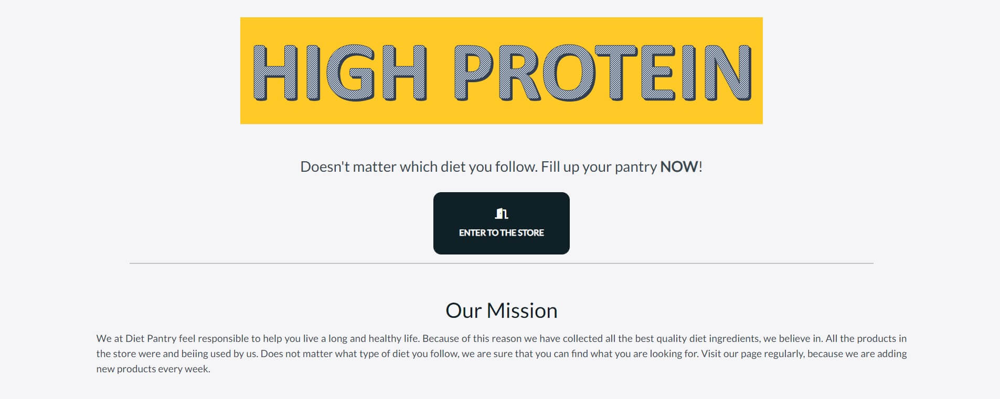

# The Diet Pantry

<h1 align="center"></h1>

Welcome to My 4th milestone project at Code Institute. The Diet Pantry website is more or less the end of a long long and hard journey in the world of Coding. The purpose of this project 
to use build a full-stack site around a business logic. I have applied everything what i have learned at Code Institute. The technologies i have used for this project are: HTML, CSS, JAvaScript, Python and Django. Stripe handles online test payments and Heroku Postgres as a relational database.

This website is a fictional webshop for people who are following different type of diets. Sometimes it is really hard to find the right and trustable products for the different diets, so this website supposed to collect the tested and trusted dietary products. 

[Live site](http://mp4-diet-pantry.herokuapp.com) 

[Github link](https://github.com/szomoru/MP4-DietPantry) 

<span id="breaktop"></span>

## Table of Contents

[1. **UX**](#1-ux)
-   [1.1 Project Goals](#1-1-project-goals)
-   [1.2 Business Goals](#1-2-business-goals)
-   [1.3 Visitor Goals](#1-3-visitor-goals)
-   [1.4 Target Audience](#1-4-target-audience)
-   [1.5 User Stories](#1-5-user-stories)
    -   [1.5.1 Visitor Goals](#1-5-1-visitor-goals)
    -   [1.5.2 Consumer Goals (Unregistered)](#1-5-2-consumer-goals)
    -   [1.5.3 Returning Consumer Goals (Registered)](#1-5-3-returning-consumer-goals)
    -   [1.5.4 Administrator Goals](#1-5-4-administrator-goals)
-   [1.6 Design](#1-6-design)
    -   [1.5.1 Visitor Goals](#1-6-1-visitor-goals)
    -   [1.5.2 Consumer Goals (Unregistered)](#1-6-2-consumer-goals)
    -   [1.5.3 Returning Consumer Goals (Registered)](#1-6-3-returning-consumer-goals)
-   [1.7 Wireframes](#1-7-wireframes)

[2. **Features**](#2-features)
-   [2.1 Existing Features](#2-1-existing-features)
-   [2.2 Possible Future Features](#2-2-possible-future-features)

[3. **Database Design**](#3-database-design)

[4. **Technologies Used**](#4-technologies-used)
-   [4.1 Languagess](#4-1-languages)
-   [4.2 Frameworks](#4-2-frameworks)
-   [4.3 Libraries](#4-3-libraries)
-   [4.4 Editors](#4-4-editors)
-   [4.5 Tools](#4-5-tools)
-   [4.6 Database Management](#4-6-database-management)
-   [4.7 Deployment Platform(s)](#4-7-deployment-platforms)
-   [4.8 Testing Tools](#4-8-testing-tools)

[5. **Testing**](#5-testing)

[6. **Deployment**](#6-deployment)
-   [6.1 Requirements for Deployment](#6-1-requirements-for-deployment)
-   [6.2 How to Fork it](#6-2-how-to-fork-it)
-   [6.3 Making a Local Clone](#6-3-making-a-local-clone)
-   [6.4 Heroku Deployment](#6-4-heroku-deployment)
-   [6.5 AWS S3 Bucket setup](#6-5-aws-s3-bucket-setup)
-   [6.6 AWS IAM (Identity and Access Management) setup](#6-6-aws-iam-identity-and-access-management-setup)
-   [6.7 Connecting Heroku to AWS S3](#6-7-connecting-heroku-to-aws-s3)

[7. **Credits**](#7-credits)
-   [7.1 Code](#7-1-code)
-   [7.2 Content](#7-2-content)
-   [7.3 Media](#7-3-media)
-   [7.4 Acknowledgements](#7-4-acknowledgements)


## 1. **UX**

<hr>

### **1-1 Project goals**
-   Making a full-stack site based around business logic used to control a centrally-owned database. 
-   The site provides an authentication mechanism and provides access to the site’s data based on the dataset. 
-   Making a full-stack site that uses HTML, CSS, JavaScript, Python + Django.
-   Creating a website that uses a relational database 
-   Creating a website that uses Stripe payments 
-   Creating a website that serves as a webshop to sell healthy food products   

### **1-2 Business goals**
-   Creating a secure and professional e-commerce website. 
-   Provide users acces to good quality healthy cooking/baking ingredients used in different type of diets 
-   Makes profit with selling healthy food products 
-   Makes healthy lifestyle and healthier food selection accessible to everyone

### **1-3 Visitor goals**
-   Get inspired beeing open minded to different diets and changing to a healthier food selection 
-   Safely purchase products on the webshop

### **1-4 Target audience**
-   Everyone who has been following, following or planning to follow a healthier diet.
-   Everyone who is interested to eat different
-   Everyone who has to eat different because of some health issues (eg Diabetes, High Blood Pressure, Overweight)

### **1-5 User stories**

-   #### **1-5-1 Visitor goals**
    1.  As a visitor, I want to access the website from any device (PC / notebook / tablet / mobile )
    2.  As a visitor, I want to be able navigtae through the website easily
    3.  As a visitor i want to be able to get more background information about the company through socail media accounts
    4.  As a visitor i want to be able to follow the company to see the lastest trends and news
    5.  As a visitor i want to be able to contact the company and ask questions
    6.  As a visitor i want to be able to see all the products on the website to see what it can offer me
    7.  As a visitor i want to be able to search among the products or filter or sort them to get easily to a specific product
    8.  As a visitor i want to be able to get more information about the product (product description, price, image about the product ...)
    9.  As a visitor i want to be able to see what other peoples opinion about the product 

-   #### **1-5-2 Consumer goals**
    1.  As a consumer i want to able to fill up a virtual shopping bag and purchasing the content of it.
    2.  As a consumer i want to have control over the content of the shopping bag until the very last step of purchasing (payment)
    3.  As a consumer i want to see the total value of my shopping bag including possible shipping fee
    4.  As a consumer i want to have a fast and safe way to pay for the ordered products 
    5.  As a consumer i want to have continous feedback about my selected operations on the website.
    6.  As a consumer i want to have confirmation e-mail about my purchase with order number.
    7.  As a consumer i want to have the possibility to create my own account to save my profile information and see my previous orders.

-   #### **1-5-3 Returning consumer goals**
    1.  As a returning consumer I have the same goals than the not returning consumers and more  
    2.  As a returning customer I want to easily login/logout to my previously created account. I also want to see my order history
    3.  As a returning consumer i want to be able to create my own favourite products database and add/remove products to that. 
    4.  As a returning consumer i want to have full control over my password, I want to be able to reset or change it.
    5.  As a returning consumer i want to see others people feedback about the product I also want to be able to write my opinion about the product 

-   #### **1-5-4 Administrator goals**
    1.  As an administartor i want to have control over the produts at the webshop. I want to be able to execute CRUD operations
        -   Create
        -   Read
        -   Update
        -   Delete

### **1-6 Design**

-   #### **1-6-1 Colour Scheme**
    There are used 2 main color groups on the website. Both groups contain 3 color codes:

    <details>
    <summary>Primary colors</summary>

    

    </details>

    <details>
    <summary>Seconary colors</summary>

       

    </details>    

    Both color groups are used either background or font color. And there are also other blight colors are used on dark background to improve color contrast ratio.
            
        

-   #### **1-6-2 Typography**
    There are 2 main font styles used through the webshop. The fonts were selected from the Google Font website. 
    <ul>
    <li>
    <details>
    <summary><strong>Sacramento</strong></summary>

    
        
    </details>
        This font is used only at the logo of the website. The reason is it is a handwriting style from the 50's - 60's. The reason to have that style for the logo that it gives more private feeling. It is needed since the name of the webshop refers to fill up someones pantry, which is already very private. 
    </li>
    <li>
    <details>
    <summary><strong>Lato</strong></summary>

    
        
    </details>
        This font is used the rest of the website. It is easy to read and longer texts are also look very good with this font. It provides stabilty and seriousness feeling. The designer of the font is <i>Łukasz Dziedzic</i>. He says about his design: <i>“Male and female, serious but friendly. With the feeling of the Summer ...”
    </i>  
    <li><strong>San-serif:</strong> This font is used as a Web safe font if the other 2 main fonts cannot be loaded some reason.</li>
    </ul>

    -   #### Imagery
        On the main page there are 4 photos which were supposed to promote healthy feeling and happiness. The 4 pictures were selected by symbolise the mission of the webshop creator. 
        Further images throught the website are only product images. The product imaes are straightforward and most cases comming from the product manufacturer database. 

### **1-7 Wireframes**

    There were several design changes during the development process, but the final site looks very similar with the wireframe. The wireframe does not contain any colorscheme, because at that time it was still not decided what colors i am going to use (Note: after a failed submit the colorscheme has been changed for better contrast ratio -more in the TESTING.md ). 
    On the following pictures the wireframes are introduced by htmls. Each image contain a desktop and phone size wireframe.  

    -   [index.html WireFrame](docs/wireframe/index.png)

    -   [products.html WireFrame](docs/wireframe/products.png) 

    -   [product_detail.html WireFrame](docs/wireframe/productdetail.png)

    -   [profile.html WireFrame](c/wireframe/profile.png) 

    -   [bag.html WireFrame](docs/wireframe/shoppingbag.png) 

    -   [checkout.html WireFrame](docs/wireframe/checkout.png) 

    -   [checkout_success.html WireFrame](docs/wireframe/thankyou.png) 

    -   [keto.html / lowcarb.html /  highprotein.html / mediterranean.html WireFrame](docs/wireframe/dietlibrary.png)

<div align="right">
    <a href="#breaktop">↥ Back to top!</a>
</div>

## 2. **Features**

<hr>
 
## 2-1 Existing Features

### Features common on every page
1.  <details>
    <summary>Header</summary>

    
    
    </details>
    
    -   **The name** (which also serves as logo) is clearly visible in the left side of the navbar. The name is also a redirect to the home page. 
    -   The navbar contains the **search functionality**, where the user can search for products. The search term would match with the product name or  the product description. 
    -   The search functionality allows users to enter keywords associated with the name or the description of the product. 
    -   The search results are displayed on the products page. 
    -   On the product page, a message will appear with ‘no results’ if there are no search results.
    -   The navbar contains the **profile icon**, where people can login, register and go to their profile.
    -   The navbar contains the **shopping bag**, where users can see the items they have put in order. The basket redirects to the order summary. 
    -   The navbar is visible as a **hamburger menu** on mobile devices.
    -   The header also contains three **dropdown menus**, which is four if the user is logged into its account 

2.  <details>
    <summary>Footer</summary>

    
    
    </details>

    -   **Relevant links** such as the categories of the products are placed at the footer left section, ahich is center position in case of small devices
    -   The **social media links** are placed at the right section of the footer, which is the bottom of the footer in case of small device. 

### Pages
1.  <details>
    <summary>Index Page</summary>

    
    
    </details>
    

2.  <details>
    <summary>Product Page</summary>

    
    
    </details>

    -   The product page contains all items the shop has to offer
    -   All **categories** are displayed on the right site of the page, so that users can easily navigate through the categories.
    -   The items can be **sorted** by name A-Z, Z-A, price from high to low and price from low to high
    -   There is a **back to top button**, where people can click on the link to go back to the top of the page. 
    -   There is a button where the user can **add the item to the shopping bag**.
    -   When the user  puts the item in the bag there will be a toast success message.
    -   When the user puts the item in the bag, the shopping bag in the navbar will show the number of items that are in the shopping bag.

3.  <details>

    <summary>Product Detail Page</summary>

    
    
    </details>

    -   **The product detail page shows information about that specific item**, the information includes; name, image, the price and the product description.
    -   A user can **choose the quantity** of the product. The product quantity can be between 1 and 99 items. 
    -   There is a button where the user can **add the item to the shopping bag**.
    -   There is as an other button where the user can **add to favourites** the actual product. This feature **available only for logged in** users.
    -   When the user  puts the item in the bag there will be a toast success message.
    -   When the user puts the item in the bag, the shopping bag in the navbar will show the number of items that are in the shopping bag.
    -   There is a **krrp shopping** link that redirects to the product page. 
    -   There is also a **review** section at the bottom. The user can **add a review** is logged into its account. right under that there is the section with **other users reviews**
     

4.  <details>
    <summary>Shopping Bag Page</summary>

    
    
    </details>

    -   **The shopping bag page is available for logged in users and guests.** Purchases can be made by both of them. shopping bag page 
    -   Gives **an overview of all items** that are in the shopping bag, the overview information includes; image, name, size, quantity, price and subtotal.
    -   users  can **update the quantity** of the items they have.
    -   users  can **delete items** from their order.
    -   There is an **overview of the total price, the delivery costs and the grant total** of the order.
    -   There is a button with **‘keep shopping’** that links to the product page. 
    -   There is a button with **‘go to checkout’** to continue the purchase

5.  <details>
    <summary>Checkout Page</summary>

    
    
    </details>

    -   The **order summary** gives information about the item, this information includes; name, size, price, total, delivery costs and grant total. 
    -   There is an option to **login with an account**, where the personal and delivery information already exists to continue the payment process quickly. 
    -   **The checkout form** to continue the payment. The form asks for the following information: full name, email, phone number, country, postal code, town or city and  street address 1 - all these input fields must be valid. The country field is an input where users can scroll to a list to choose the country.
    -   At the end of the checkout form there is an option to **save** the delivery information to an account. This function only shows when the user is authenticated.
    -   The user has to fill in their information about the card number. The Stripe functionality is in testing mode, the credit card number **4242 4242 4242 4242** will lead to a successful payment. expiration date, CVC and ZIP can be made up yourself.
    -   A **webhook** is used for security when the order is processed, even in the case when the payment process is interrupted.
    -   There is a **button to go back to the shopping bag page.** The user can go back to the shopping bag page to adjust items in the bag.
    -   There is a button to **complete the order**.
    -   When the user clicks on the complete the order button, there is a little **loading overlay**. The user is directed to the checkout success page after the overlay. 
    -   **When the order is completed:**
        - There is a redirect to the checkout success page.
        - A confirmation email is sent to the user’s mail.
        - A toast message ‘completed’ shows to ensure the user that the order is successfully completed.

6.  <details>
    <summary>Checkout Success (Thank You) Page</summary>

    
    
    </details>

    -   Contains a **thank you message**.
    -   Includes information about the **order summary**. The order summary consists of information about the date, order number, products, delivery information and billing information. 
    -   There is a button to go back to the product page.

7.  <details>
    <summary>Profile Page</summary>

    
    
    </details>

    -   The account page is only accessible for users who have an account. 
    -   The page contains a **personal info section** (username, email). The user can change the password and edit their email. 
    -   There is a shipping **info section** (country, postal code, town/city, street address 1 and street address 2. Users can **edit this information** also. 
    -   There is an **order history** section (order number, date of order, items and total) 

8.  <details>
    <summary>Diet Page</summary>

    
    
    </details>

    -   This page is **available only for logged in** users. These pages about the **different diet types** are devided into 4 main sections
    -   Each section **contains a link to the source** at the bottom left corner of the card

9.  <details>
    <summary>Favourites Page</summary>

    
    
    </details>

    
    -   This page is **available only for logged in** users. On this page the user can see **only those products**, where the user has clicked on the **add to favourites** button. 
    -   The user has the possibility to remove products from the favourites by clicking on the  **remove from favourites** button

10. Django-Allauth features 
    -   **Sign up**
        -   Users can create a new account by filling in a from where the user have to fillin a email, username, password and password confirmation. If the info already exists there will be a message that he/she already has an account. The user can submit the form when the data is new. A verification email is sent to the user.
    -   **Login**
        -   Users can login with their username ans password. There is also a link to change the password, if the user is forgotten it. 
    -   **Forgot password**
        -   A user can reset their password. 
    -   **Logout** 
        -   The user can logout by clicking the logout link. After clicking the link there wil a confirmation if the user is sure to logout. 

11. Error pages 
    -   There are custom error handling pages with short information about the error. The errors are displayed in the style of the website. 
    -   The following errors are included: 404 and 500.
    
## 2-2 Possible Future Features


<div align="right">
    <a href="#breaktop">↥ Back to top!</a>
</div>

## 3. **Database design**

<hr>

There were used relational databases for this project. During development phase i have used SQLite, and in production Heroku PostgreSQL was used. You can find attached the database schema on the link bellow.


<div align="right">
    <a href="#breaktop">↥ Back to top!</a>
</div>


## 4. **Technologies used**

<hr>

### 4-1 Languages ###
-   [HTML5](https://en.wikipedia.org/wiki/HTML5)
    -   HTML5 provides the structure and the content of my website
-   [CSS3](https://en.wikipedia.org/wiki/CSS)
    -   CSS3 provides the style of the HTML5 elements
-   [JavaScript](https://en.wikipedia.org/wiki/JavaScript)
    -   JS provides the interactive part
-   [Python](https://en.wikipedia.org/wiki/Python_(programming_language))
    -   The backend of the website is provided by Python
-   [Jinja](https://en.wikipedia.org/wiki/Jinja_(template_engine))
    -   Jinja is a web template language for python


### 4-2 Frameworks ###
-   [Django](https://www.djangoproject.com/)
    -   Django is used as Python framework in this project


### 4-3 Libraries ###
-   [Bootstrap CSS Framework](https://getbootstrap.com/)
    -   One of the largest pre-built library of HTML and CSS components. It was used every section of the webpage just like buttons or navigation ...
-   [Font Awesome](https://fontawesome.com/)
    -   This library is used for getting icons
-   [Google Fonts](https://fonts.google.com/)
    -   Font library
-   [JQuery](https://jqueryui.com/)
    -   JavaScript library. MAinly used to simplify DOM manipulation and JS simplification


### 4-4 Editors ###
-   [GitHub](https://github.com/)
    -   Remote code repository. It was use for source control 
-   [dbDiagram](https://dbdiagram.io/)
    -   Plan and visualize database structures
-   [Balsamiq](https://balsamiq.com/)
    -   Wireframe creator for visual testing


### 4-5 Tools ###
-   [TinyPNG](https://tinypng.com/)
    -   Minimize image file size to deacrease the loading time, so maximize the webpage speed
-   [Autoprefixer](https://autoprefixer.github.io/)
    -   Vendor prefixes to CSS rules 
-   [Am I Responsive](http://ami.responsivedesign.is/)
    -   Creates demo views for ewsponsive design. Readme hero image was created by it.
-   [Lambdatest](https://www.lambdatest.com/)
    -   Check website response across device types

### 4-6 Database Management ###
-   [SQLite3](https://www.sqlite.org/)
    -   It was used as the Development Database
-   [PostgreSQL](https://www.postgresql.org/)
    -   It was used as the production Database


### 4-7 Deployment platform(s) ###
-   [Heroku](https://dashboard.heroku.com/)
        -   Remote hosting platform, it was used to hos my project
-   [Amazon AWS](https://aws.amazon.com/)
        -   AWS Amazon is used to store static and media files.

### 4-8 Testing Tools ###
-   [Chrome DevTool](https://developer.chrome.com/docs/devtools/open/)
    -   was used to check site responsiveness, and as a general debugger
-   [W3C Markup Validator](https://validator.w3.org/)
    -   This Validator is used to check if there is any eror in the HTML5 code
-   [W3C CSS Validator](https://jigsaw.w3.org/css-validator/)
    -   This validator is used to check if there is any error in the CSS3 code
-   [JShint](https://jshint.com/)
    -   JShint validator can find errors in JavaScript codes
-   [PEP8](http://pep8online.com/) 
        -   was used to validate the python syntax.
-   [Lighthouse](https://developers.google.com/web/tools/lighthouse/)
    -   was used to check the site's Performance, Accessibility, Best Practices, and SEO.

<div align="right">
    <a href="#breaktop">↥ Back to top!</a>
</div>

## **5. Testing**

<hr>

You can find the detailed testing description by clicking on the link below:

[TESTING.MD](TESTING.md)

<div align="right">
    <a href="#breaktop">↥ Back to top!</a>
</div>

## 6. **Deployment**

<hr>

### **6-1 Requirements for Deployment**

* Python3
* GitHub account
* Heroku account
* Stripe account
* AWS Amazon account
* An email account preferably Gmail


### **6-2 How to Fork it**

1. Login or Sign Up to [GitHub](www.github.com).
2. On GitHub, go to [szomoru/MP4-DietPantry](https://github.com/szomoru/MP4-DietPantry).
3. In the top right, click "Fork".
4. You will need to create an env.py file with your own values, and create a MongoDB database with the data keys and types as shown above.
5. You will also need to install all of the project requirements. This can be done using the command:
    * `pip3 install -r requirements.txt`
6. Type `python3 app.py` in your GitPod terminal to run your local site of this project.

### **6-3 Making a Local Clone**

1. Log in to [GitHub](https://www.github.com) and locate the [Repository](https://github.com/szomoru/MP4-DietPantry) for this site.
2. Under the repository name, above the list of files, click "Code".
3. Here you can either Clone or Download the repository.
4. You should clone the repository using HTTPS, clicking on the icon to copy the link.
5. Open Git Bash.
6. Change the current working directory to the new location, where you want the cloned directory to be.
7. Type `git clone`, and then paste the URL that was copied in Step 4.
    * `git clone https://github.com/szomoru/MP4-DietPantry.git`
8. Press Enter, and your local clone will be created.
9. You will need to create an env.py file with your own values, and create a MongoDB database with the data keys and types as shown above.
10. You will also need to install all of the project requirements. This can be done using the command:
    * `pip3 install -r requirements.txt`.
11. Type `python3 app.py` in your Gitpod terminal to run your local site of this project.

Alternatively, if using Gitpod, you can click below to create your own workspace using this repository.

[](https://gitpod.io/#https://github.com/szomoru/MP4-DietPantry)


### **6-4 Heroku Deployment**

1. Log into Heroku
2. Create a new app, choose a location closest to you
3. Search for Heroku Postgres from the resources tab and add to your project
4. Make sure to have `dj_database_url` and `psycopg2` installed.
```
pip3 install dj_database_url
pip3 install psycopg2
```
5. Login to the Heroku CLI - `heroku login -i`
6. Run migrations on Heroku Postgres - `heroku run python manage.py migrate`
7. Create a superuser - `python manage.py createsuperuser`
8. Install `gunicorn` - `pip3 install gunicorn`
9. Create a requirements.txt file - `pip3 freeze > requirements.txt`
10. Create a `Procfile` (note the capital P), and add the following,
```
web: gunicorn mp4-dietpantry.wsgi:application
```
11. Disable Heroku from collecting static files - `heroku config:set DISABLE_COLLECTSTATIC=1 --app <your-app-name>`
12. Add the hostname to project settings.py file
```
ALLOWED_HOSTS = ['<you-app-name>.herokuapp.com', 'localhost']

```
13. Connect Heroku to you Github, by selecting Github as the deployment method and search for the github repository and pressing `connect`
14. In Heroku, within settings, under config vars select `Reveal config vars`
15. Add the following, 
```
AWS_ACCESS_KEY_ID =	<your variable here>
AWS_SECRET_ACCESS_KEY =	<your variable here>
DATABASE_URL =	<added by Heroku when Postgres installed>
DISABLE_COLLECTSTATIC =	1 
EMAIL_HOST_PASS = <your variable here>
EMAIL_HOST_USER = <your variable here>
SECRET_KEY = <your variable here>
STRIPE_PUBLIC_KEY = <your variable here>
STRIPE_SECRET_KEY = <your variable here>
STRIPE_WH_SECRET = <different from env.py>
USE_AWS = True
```
16. Go back to the Deploy tab and under Automatic deploys choose `Enable Automatic Deploys`
17. Back in your CLI add, commit and push your changes and Heroku will automatically deploy your app
```
git add .
git commit -m "Initial commit"
git push
```
18. Your deployed site can be launched by clicking `Open App` from its page within Heroku.

### **6-5 AWS S3 Bucket setup**
1. Create an Amazon AWS account
2. Search for S3 and create a new bucket
    - Allow public access
3. Under Properties > Static website hosting
    - Enable
    - index.html as index.html
    - save
4. Under Permissions > CORS use the following:
```
[
  {
      "AllowedHeaders": [
          "Authorization"
      ],
      "AllowedMethods": [
          "GET"
      ],
      "AllowedOrigins": [
          "*"
      ],
      "ExposeHeaders": []
  }
]
```
5. Under Permissions > Bucket Policy:
    - Generate Bucket Policy and take note of Bucket ARN
    - Chose S3 Bucket Policy as Type of Policy
    - For Principal, enter *
    - Enter ARN noted above
    - Add Statement
    - Generate Policy
    - Copy Policy JSON Document
    - Paste policy into Edit Bucket policy on the previous tab
    - Save changes
6. Under Access Control List (ACL):
    - For Everyone (public access), tick List
    - Accept that everyone in the world may access the Bucket
    - Save changes

### **6-6 AWS IAM (Identity and Access Management) setup**
1. From the IAM dashboard within AWS, select User Groups:
    - Create a new group
    - Click through and Create Group
2. Select Policies:
    - Create policy
    - Under JSON tab, click Import managed policy
    - Choose AmazongS3FullAccess
    - Edit the resource to include the Bucket ARN noted earlier when creating the Bucket Policy
    - Click next step and go to Review policy
    - Give the policy a name and description of your choice
    - Create policy
3. Go back to User Groups and choose the group created earlier
    - Under Permissions > Add permissions, choose Attach Policies and select the one just created
    - Add permissions
4. Under Users:
    - Choose a user name 
    - Select Programmatic access as the Access type
    - Click Next
    - Add the user to the Group just created
    - Click Next and Create User
5. Download the `.csv` containing the access key and secret access key.
    - **THE `.csv` FILE IS ONLY AVAILABLE ONCE AND CANNOT BE DOWNLOADED AGAIN.**

### **6-7 Connecting Heroku to AWS S3**
1. Install boto3 and django-storages
```
pip3 install boto3
pip3 install django-storages
pip3 freeze > requirements.txt
```
2. Add the values from the `.csv` you downloaded to your Heroku Config Vars under Settings:
3. Delete the `DISABLE_COLLECTSTATIC` variable from your Cvars and deploy your Heroku app
4. With your S3 bucket now set up, you can create a new folder called media (at the same level as the newly added static folder) and upload any required media files to it.
    - **PLEASE MAKE SURE `media` AND `static` FILES ARE PUBLICLY ACCESSIBLE UNDER PERMISSIONS**

<div align="right">
    <a href="#breaktop">↥ Back to top!</a>
</div>

## 7. **Credits**

<hr>

### **7-1 Code**

-   [Bootstrap4](https://getbootstrap.com/docs/4.4/getting-started/introduction/): Bootstrap Library used throughout the project mainly to make site responsive using the Bootstrap Grid System.

-   [W3Schools](https://www.w3schools.com/): I have used their content many times to understand CSS and HTML, JavaScript and learned a lot from their content

-   [Froggy](https://flexboxfroggy.com/): I have used this cute educator site to understand better the flexbox method

-   [CSS tricks](https://css-tricks.com/): I have also learned a lot and found interesting topics on the CSS-tricks website

-   [Stackoverflow community](https://stackoverflow.com/): I have read a lot of forums and got a lot of hints how to continue when i was stucked.

### **7-2 Content**

-   All content was written by the developer -Gergely Vig. 
- I have used the following documents as a support and inspiration for the README.md file:
    - Code Institute [SampleREADME](https://github.com/Code-Institute-Solutions/SampleREADME)
    - Code Institute [README Template](https://github.com/Code-Institute-Solutions/readme-template)
    - [Markdown Cheatsheet](https://github.com/adam-p/markdown-here/wiki/Markdown-Cheatsheet#code)
    - [Mastering Markdown](https://guides.github.com/features/mastering-markdown/)
    - [Gergely Vig](https://github.com/szomoru/Extrahand-mp3)
   
    

### **7-3 Media**

- 
    

### **7-4 Acknowledgements**

-   My Mentor for helpful feedback.
-   Thanks to my family specially my wife who taken over our 4 kids while i was doing my studies. 

<div align="right">
    <a href="#breaktop">↥ Back to top!</a>
</div>