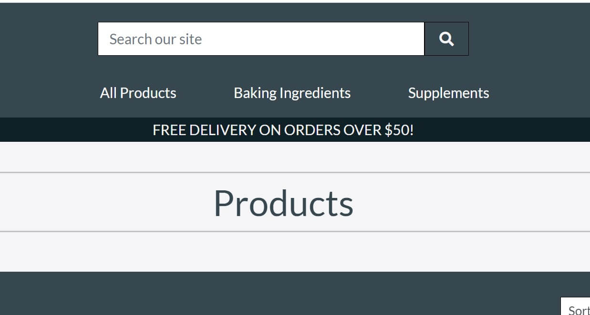
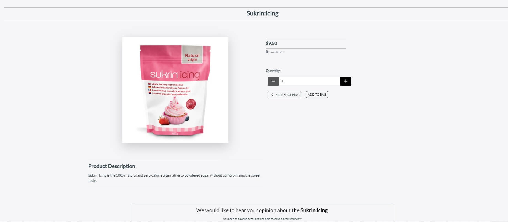

<h1 align="center">Testing</h1>

[1. **Manual Testing**](#1-manual-testing)
-   [1.1 Visitor Goals](#1-1-visitor-goals)
-   [1.2 Consumer Goals (Unregistered)](#1-2-consumer-goals-unregistered)
-   [1.3 Returning Consumer Goals (Registered)](#1-3-returning-consumer-goals-registered)
-   [1.4 Administrator Goals](#1-4-administrator-goals)

[2. **Validators**](#2-validators)
-   [2.1 HTML Validator](#2-1-html-validator)
-   [2.2 CSS Validator](#2-2-css-validator)
-   [2.3 JSHint](#2-3-jshint)
-   [2.4 Python Validator (PEP8)](#2-4-python-validator-pep8)
-   [2.5 Lighthouse](#2-5-lighthouse)

[3. **Other Tests performed**](#3-other-tests-performed)
-   [3.1 Color Contrast Check](#3-1-color-contrast-check)

[4. **Bugs during development**](#4-bugs-during-development)
-   [4.1 E-mail sending](#4-1-email-sending)
-   [4.2 Am I responsive](#4-2-am-i-responsive)

## **1. Manual Testing**

### **1-1 Visitor Goals**
1.  As a visitor, I want to access the website from any device (PC / notebook / tablet / mobile )
    -   **Testing:** The testing was performed first in the Chrome Devtools to check the responsivness and later the access was checked phisically different devices.
    -   **Result:** ***PASSED***

2.  As a visitor, I want to be able navigtae through the website easily
    -   **Testing:** I have performed a test, involving test users from the family to click on the links if they are working. I also gave them tasks to perform on the websitem like: purchase 1 protein powder and 2 vitamins etc. The structure of the pages are the same allover the webshop. The top Navigation bar is always visible and accessibla in every device sizes, so the possibility to browse on the site with different navbar menus is given all the time.

        
     
    -   **Result:** Since my test users could be taken consideration as first time visitors and they did not experienced any difficulties to perform my requests and they have not found any dead links i consider this test as ***PASSED***

3.  As a visitor i want to be able to get more background information about the company through socail media accounts
    -   **Testing:** All the social media links are present in the footer sectionallover the entire website. Though the footer is not fixed or sticky the visitor has to scroll down to the bottom of the page to see them. All the social media link has been tested allover the entire webpage and there were no issues with them. In every cases the icon represented social media platform opened in a separate window.

        

    -   **Result:** ***PASSED***

4.  As a visitor i want to be able to follow the company to see the lastest trends and news
    -   **Testing:** On all social media platform there is the possibility to follow the company. Also the company focus more on social media campaigns then e-mail campaigns.
    -   **Result:** ***PASSED***

5.  As a visitor i want to be able to contact the company and ask questions
    -   **Testing:** This also possible through the different social media platforms. If the contact is connected to an order, the order confirmation email contains all the correct contact informations.

        

        
Confirmation E-mail

        
        

    -   **Result:** ***PASSED***

6.  As a visitor i want to be able to see all the products on the website to see what it can offer me
    -   **Testing:** By entering into the shop from the Home page the visitor can see all the products right way. From therepoint the visitor can sort the products, search for products or select different categories products. In the navigation bar - which is always visible on every screen - these possibilites are always given.

        

        
Sorting / Filtering / Searching Products

        

        

        
        

    -   **Result:** ***PASSED***

7.  As a visitor i want to be able to search among the products or filter or sort them to get easily to a specific product
    -   **Testing:** The previous test description has already given the answer to this point. See **Visitor Goals nr 6**
    -   **Result:** ***PASSED***

8.  As a visitor i want to be able to get more information about the product (product description, price, image about the product ...)
    -   **Testing:** Every product has its on product detail page. The visitor can see all the detailed product information before place it into the shopping bag. The product detail page also provide extra information with the product reviews.

        

        
Product Detail

        
        

    -   **Result:** ***PASSED***

9.  As a visitor i want to be able to see what other peoples opinion about the product 
    -   **Testing:** The visitor can see all other user reviews on the product detail page independently if the visitor has an account or not with the store.
    -   **Result:** ***PASSED***

    
### **1-2 Consumer Goals (Unregistered)**
1.  As a consumer i want to able to fill up a virtual shopping bag and purchasing the content of it.
    -   **Testing:** The consumer has the possibility to place any of the products into the shopping bag from the detailed product page. The consumer has the possibility to change the quantity of the products or even delete them from the shopping bag. Moreover the consumer can return back to the product page and continue shopping if she/he wants. When the consumer satisfied with the content of the shopping bag she/he can purchase them through a **secure payment** process, which is provided by **STRIPE** 
    -   **Result:** All the above mentioned features has been actively tested and experienced no problem with them. The result of the consumer selected steps were continuesly cinfirmed by toasts. ***PASSED***

2.  As a consumer i want to have control over the content of the shopping bag until the very last step of purchasing (payment)
    -   **Testing:** The cosumer has the possibility to manipulate the content of the shopping bag until the last payment step. The different possibilities on different pages towards the payment process:
        - **Product Detail Page:** the consumer has the possibility to select the required quantity or return back to the Products 

        - **Shopping Bag Page:** the consumer has the possibility to **change** the quantity of the selected product, **remove** the selected product or **continue shopping** by selecting the keep shopping button. On this page the consumer can manipulate the different products individually

        - **Checkout Page:** at this stage the consumer cannot modify the products, but has the possibility to return back to the shopping bag by selecting the "Adjust bag" button at the bottom of the page

        

        
Porduct Detail / Shopping Bag / Checkout

        

        

        
        

    -   **Result:** ***PASSED***

3.  As a consumer i want to see the total value of my shopping bag including possible shipping fee
    -   **Testing:** through the purchasing process the **Shopping Bag** page and the **Checkout Page** give information about the **Sub-/Grand-Total** values and about the possible **Shipping fee**. The website provide **Free Shipping** if the order value is more than $50, otherwise the shipping fee is calculated as 10% of the order value.
    -   **Result:** all the above mentioned features were tested without any failure ***PASSED***

4.  As a consumer i want to have a fast and safe way to pay for the ordered products 
    -   **Testing:** 
        - Consumers can pay with credit card and the payment goes via Stripe payments. 
        - The stripe setup is based on a test environment. A consumer can fill in the number 4242 4242 4242 4242  to make a succesful payment. 
        - A Stripe webhook is implemented for extra secure payments. 
        - The consumer has to fill in personal information and delivery information. 
            - The required fields are full name, email address, phone number, country, town or city and street address 1. 
            - The email has a validator where someone has to use a @. 
            - The country field is a dropdown with all countries. 
    -   **Result:** The above mentioned payment system has been tested several times, since the beginning I had problem with that (problem description and solution can be found in this Testing document in an other chapter) ***PASSED***

5.  As a consumer i want to have continous feedback about my selected operations on the website.
    -   **Testing:** The consumer contonpusly get a toast message as a feedback the success of the selected operation. Type of Toasts: Error / Info / Success / Warning
    The attached image shows an example of a **Success Toast**. The Toast also contains the message what was success. Tis functionality was always a focus point of the test
        

        
Success Toasts

             
             
    

    -   **Result:** ***PASSED***

6.  As a consumer i want to have confirmation e-mail about my purchase with order number.
    -   **Testing:** 
        - When the purchase is succeeded the consumer is redirected to the checkout success page. On the page there is an order summary and it mentions that the consumer will receive an email confirmation. 
        - The email is connected with gmail and when the purchase is made, an automatic confirmation is sent from **ci.gergely.vig@gmail.com**

            

            
Confirmation Email

            
            

    -   **Result:** ***PASSED***

7.  As a consumer i want to have the possibility to create my own account to save my profile information and see my previous orders.
    -   **Testing:** The consumer can create her/his own account by signing up. Personal information, delivery information and the order history are visible on the Profile page. The consumer can change the delivery information by updating the details and the consumer can change the password or manage email

    -   **Result:** ***PASSED***

### **1-3 Returning Consumer Goals (Registered)**
1.  As a returning consumer I have the same goals than the not returning consumers and more
    -   **Testing:** All the functionality is accessable for a registered consumer as the not registered consumer. The registered consumer has actually more features in their account. They can see an extra menupoint called **Diet Library** in the header section. The registerd consumer also has the possibility to **leave a review** or **see the ordere history** or **add products to favourites**

    -   **Result:** authorization has been tested and worked correctly ***PASSED***

2.  As a returning customer I want to easily login/logout to my previously created account. I also want to see my order history
    -   **Testing:** The returning consumer can login and logout through the link under the profile icon in the navbar. The consumer has a double check for logging out.
    -   **Result:** ***PASSED***

3.  As a returning consumer i want to be able to create my own favourite products database and add/remove products to that. 
    -   **Testing:** As a registered returning consumer has the permission to add a product into the Favourites. This can happen on the **Products page** by clicking on the **Add to Favourites** button on the product card or on the **Product Detailed Page** b ya also clicking on the **Add to Favourites** button.
    -   **Result:** ***PASSED***

4.  As a returning consumer i want to have full control over my password, I want to be able to reset or change it.
    -   **Testing:** The password for a registered returning consumer can be changed by clicking the button on the profile page or by the login page.
    -   **Result:** ***PASSED***

5.  As a returning consumer i want to see others people feedback about the product I also want to be able to write my opinion about the product 
    -   **Testing:** As a registered returning consumer has the authorization to leave review for a product on the product detail page. 
    -   **Result:** ***PASSED***

    ***All related Returning Consumer Images:***

    

    
Not Registered User Navbar

    
    

    

    
Registered User Navbar

    
    

    

    
Not Registered User Product Detail Page

    
    

    

    
Registered User Product Detail Page

    
    

    

    
Not Registered User Product Detail Page - Review

    
    

    

    
Registered User Product Detail Page - Review

    
    

### **1-4 Administrator Goals**
1.  As an administartor i want to have control over the produts at the webshop. I want to be able to execute CRUD operation
    -   **Testing:** It is only the Admin who has the possibility to add product / modify product or even delete a product. Under the my profile menu it is only the admin who can see the Product management feature. By selecting it the Admin is able to uplad a new produc into the database. Under the Admin accountit is only the Admin who can dee the Delete and Edit buttons on the individual products. The normal users are not authorised to see them.
    -   **Result:** All the Create / Update and Delete functionality were tested and worked as it should be ***PASSED*** 

        

        
Admin Navbar

        
        

        

        
Admin Product Detail Page

        
        

        

        
Admin Product Management Page

        
        

