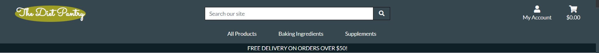

<h1 align="center">Testing</h1>

[1. **Manual Testing**](#1-manual-testing)
-   [1.1 Visitor Goals](#1-1-visitor-goals)
-   [1.2 Consumer Goals (Unregistered)](#1-2-consumer-goals-unregistered)
-   [1.3 Returning Consumer Goals (Registered)](#1-3-returning-consumer-goals-registered)
-   [1.4 Administrator Goals](#1-4-administrator-goals)

[2. **Validators**](#2-validators)
-   [2.1 HTML Validator](#2-1-html-validator)
-   [2.2 CSS Validator](#2-2-css-validator)
-   [2.3 JSHint](#2-3-jshint)
-   [2.4 Python Validator (PEP8)](#2-4-python-validator-pep8)
-   [2.5 Lighthouse](#2-5-lighthouse)

[3. **Other Tests performed**](#3-other-tests-performed)
-   [3.1 Flake8](#3-1-flake8)
-   [3.2 Color Contrast Check](#3-2-color-contrast-check)

[4. **Bugs during development**](#4-bugs-during-development)
-   [4.1 E-mail sending](#4-1-email-sending)
-   [4.2 Am I rsponsive](#4-2-am-i-responsive)

## **1. Manual Testing**

### **1-1 Visitor Goals**
1.  As a visitor, I want to access the website from any device (PC / notebook / tablet / mobile )
    -   **Testing:** The testing was performed first in the Chrome Devtools to check the responsivness and later the access was checked phisically different devices.
    -   **Result:** ***PASSED***

2.  As a visitor, I want to be able navigtae through the website easily
    -   **Testing:** I have performed a test, involving test users from the family to click on the links if they are working. I also gave them tasks to perform on the websitem like: purchase 1 protein powder and 2 vitamins etc. The structure of the pages are the same allover the webshop. The top Navigation bar is always visible and accessibla in every device sizes, so the possibility to browse on the site with different navbar menus is given all the time.

        
     
    -   **Result:** Since my test users could be taken consideration as first time visitors and they did not experienced any difficulties to perform my requests and they have not found any dead links i consider this test as ***PASSED***

3.  As a visitor i want to be able to get more background information about the company through socail media accounts
    -   **Testing:** All the social media links are present in the footer sectionallover the entire website. Though the footer is not fixed or sticky the visitor has to scroll down to the bottom of the page to see them. All the social media link has been tested allover the entire webpage and there were no issues with them. In every cases the icon represented social media platform opened in a separate window.

        

    -   **Result:** ***PASSED***

4.  As a visitor i want to be able to follow the company to see the lastest trends and news
    -   **Testing:** On all social media platform there is the possibility to follow the company. Also the company focus more on social media campaigns then e-mail campaigns.
    -   **Result:** ***PASSED***

5.  As a visitor i want to be able to contact the company and ask questions
    -   **Testing:** This also possible through the different social media platforms. If the contact is connected to an order, the order confirmation email contains all the correct contact informations.

        

    -   **Result:** ***PASSED***

6.  As a visitor i want to be able to see all the products on the website to see what it can offer me
    -   **Testing:** By entering into the shop from the Home page the visitor can see all the products right way. From therepoint the visitor can sort the products, search for products or select different categories products. In the navigation bar - which is always visible on every screen - these possibilites are always given.

        

        

        

    -   **Result:** ***PASSED***

7.  As a visitor i want to be able to search among the products or filter or sort them to get easily to a specific product
    -   **Testing:** The previous test description has already given the answer to this point. See **Visitor Goals nr 6**
    -   **Result:** ***PASSED***

8.  As a visitor i want to be able to get more information about the product (product description, price, image about the product ...)
    -   **Testing:** Every product has its on product detail page. The visitor can see all the detailed product information before place it into the shopping bag. The product detail page also provide extra information with the product reviews.

        

    -   **Result:** ***PASSED***

9.  As a visitor i want to be able to see what other peoples opinion about the product 
    -   **Testing:** The visitor can see all other user reviews on the product detail page independently if the visitor has an account or not with the store.
    -   **Result:** ***PASSED***

    
### **1-2 Consumer Goals (Unregistered)**
1.  As a consumer i want to able to fill up a virtual shopping bag and purchasing the content of it.
    -   **Testing:**
    -   **Result:** ***PASSED***

2.  As a consumer i want to have control over the content of the shopping bag until the very last step of purchasing (payment)
    -   **Testing:**
    -   **Result:** ***PASSED***

3.  As a consumer i want to see the total value of my shopping bag including possible shipping fee
    -   **Testing:**
    -   **Result:** ***PASSED***

4.  As a consumer i want to have a fast and safe way to pay for the ordered products 
    -   **Testing:**
    -   **Result:** ***PASSED***

5.  As a consumer i want to have continous feedback about my selected operations on the website.
    -   **Testing:**
    -   **Result:** ***PASSED***

6.  As a consumer i want to have confirmation e-mail about my purchase with order number.
    -   **Testing:**
    -   **Result:** ***PASSED***

7.  As a consumer i want to have the possibility to create my own account to save my profile information and see my previous orders.
    -   **Testing:**
    -   **Result:** ***PASSED***

### **1-3 Returning Consumer Goals (Registered)**
1.  As a returning consumer I have the same goals than the not returning consumers and more
    -   **Testing:**
    -   **Result:** ***PASSED***

2.  As a returning customer I want to easily login/logout to my previously created account. I also want to see my order history
    -   **Testing:**
    -   **Result:** ***PASSED***

3.  As a returning consumer i want to be able to create my own favourite products database and add/remove products to that. 
    -   **Testing:**
    -   **Result:** ***PASSED***

4.  As a returning consumer i want to have full control over my password, I want to be able to reset or change it.
    -   **Testing:**
    -   **Result:** ***PASSED***

5.  As a returning consumer i want to see others people feedback about the product I also want to be able to write my opinion about the product 
    -   **Testing:**
    -   **Result:** ***PASSED***

### **1-4 Administrator Goals**
1.  As an administartor i want to have control over the produts at the webshop. I want to be able to execute CRUD operations
    -   Create
        -   **Testing:**
        -   **Result:** ***PASSED***

    -   Read
        -   **Testing:**
        -   **Result:** ***PASSED***

    -   Update
        -   **Testing:**
        -   **Result:** ***PASSED***

    -   Delete
        -   **Testing:**
        -   **Result:** ***PASSED***

